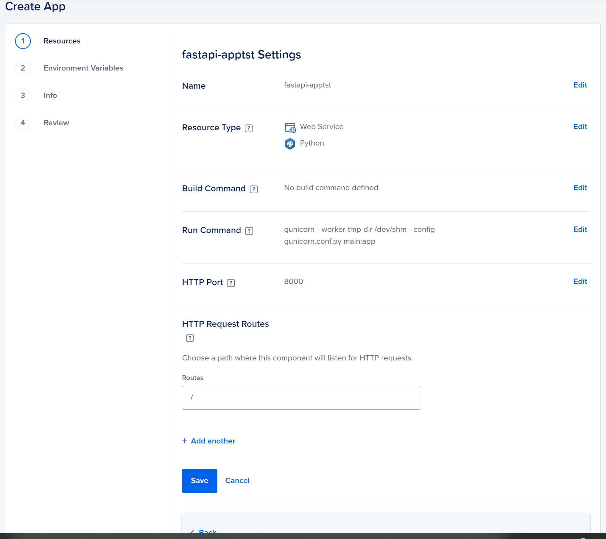
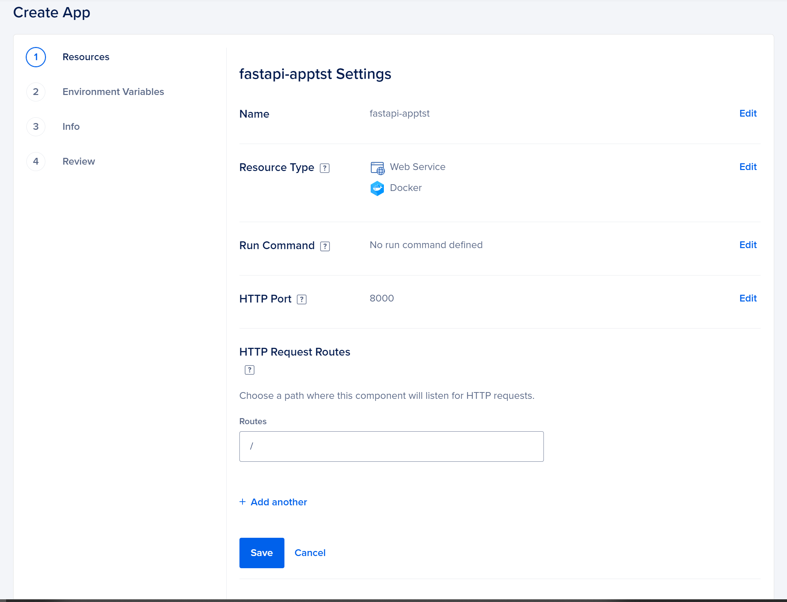

# How to deploy FastAPI Application to Digital Ocean
Use this as a template to deploy FastAPI on digitalOcean
[](https://www.digitalocean.com/?refcode=f2e79e05fefd&utm_campaign=Referral_Invite&utm_medium=Referral_Program&utm_source=badge)

https://m.do.co/c/f2e79e05fefd

### **1.** Using Procfile 
* In digital ocean, the settings should be as shown in the snapshot below
* The run command in digital ocean app settingg should be the same as that in the ***Procfile***
* make sure the Host port is same as that in the ***gunicorn.conf.py*** 
* See the screenshop below on how to setupp your app
* set the root-path in the main file based on you directory tree 
    ```
      app = FastAPI(
        title="fastapi-apptst",
        version=0.1,
        root_path="/"
      )
    ```
* Notice the Route in the settings */* . if not the same you will have an error when you navigate to openAPI */docs*



### **2.** Using Docker
* In digital ocean, the settings for docker FastAPI should be as shown in the snapshot below
* Notice run command is blank in digtal ocean app settings. This because it is already configured in the  ***entrypointcmd.sh*** bash file
* make sure the Host port is same as that in the ***gunicorn.conf.py*** 
* See the screenshop below on how to setup your digital ocean docker app
* Set the root_path in the main file based on you directory tree 
    ```
      app = FastAPI(
        title="fastapi-apptst",
        version=0.1,
        root_path="/"
      )
    ```
* Notice the Route in the settings */* . if not the same you will have an error when you navigate to openAPI */docs*



## Deploying the App

Click this button to deploy the app to the DigitalOcean App Platform. If you are not logged in, you will be prompted to log in with your DigitalOcean account.

[](https://cloud.digitalocean.com/apps/new?repo=https://github.com/kabuchanga/fastapi-apptst/tree/main&refcode=f2e79e05fefd)

If you want to automatically re-deploy your app, [fork](https://docs.github.com/en/github/getting-started-with-github/fork-a-repo) the GitHub repository to your account so that you have a copy of it stored to the cloud. Click the **Fork** button in the GitHub repository and follow the on-screen instructions.

##### Credits to:
* https://github.com/digitalocean/sample-python
* https://dev.to/mrcartoonster/fastapi-do-deploy-1h10 
* https://github.com/zubin-madon/NFTrees
* https://docs.digitalocean.com/products/app-platform/reference/buildpacks/python/
##### NB:
* When deploying to Digital Ocean, 2 applictions will be detected because I have Doker file and Procfile. Thus you will deploy two(Procfile & Docker) instances of the same code base
* You may delete any, so that you can deploy one app at a time.

##### Good Luck!! with your first FastAPI on Digital Ocean


